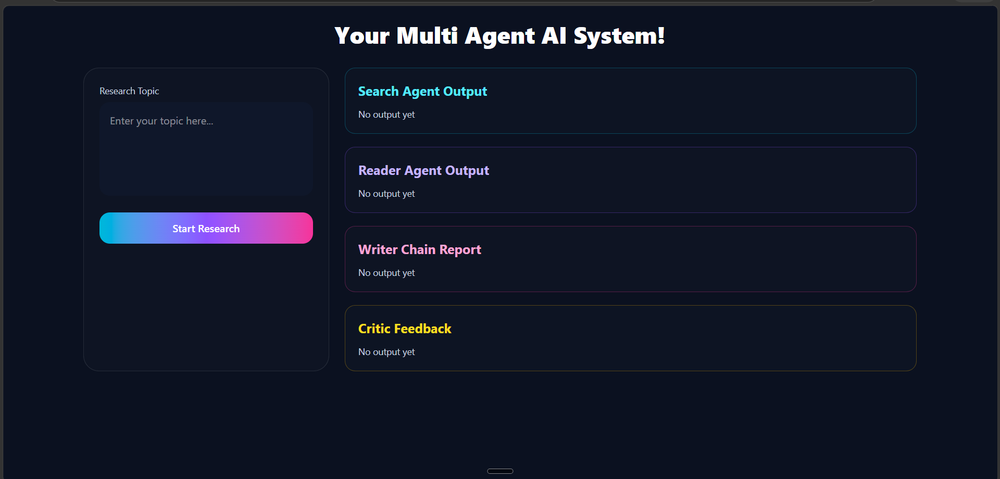
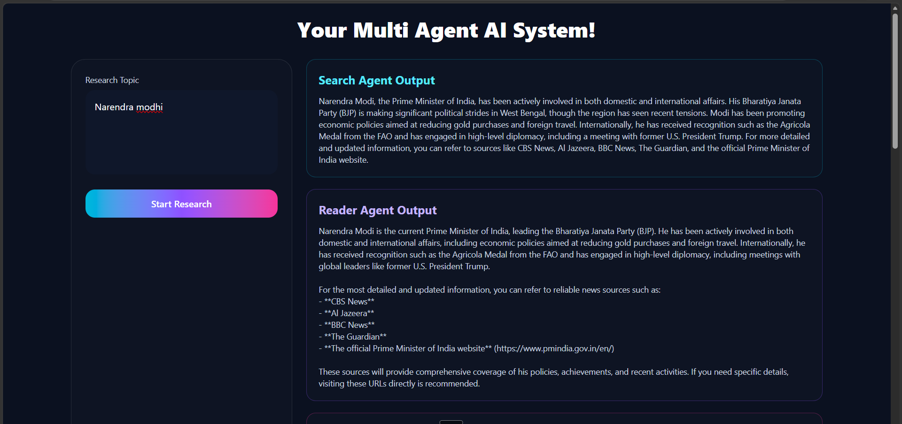
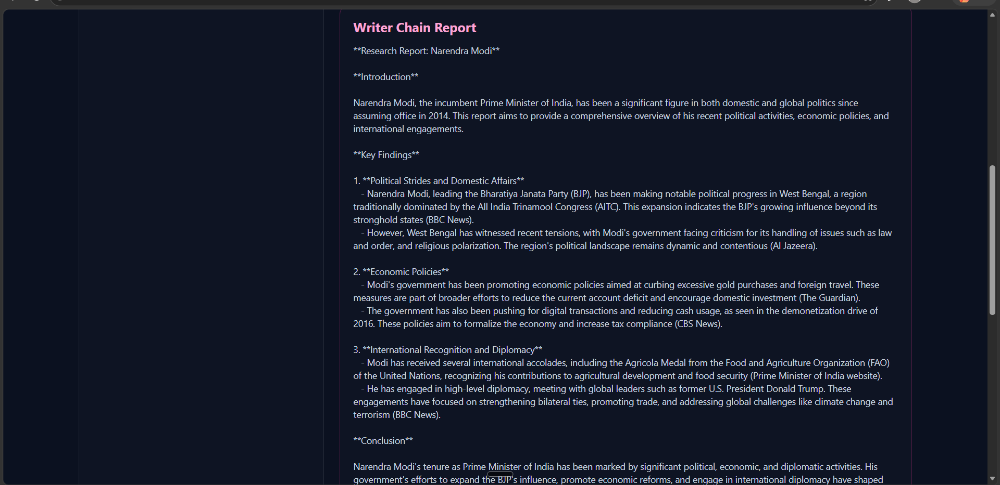
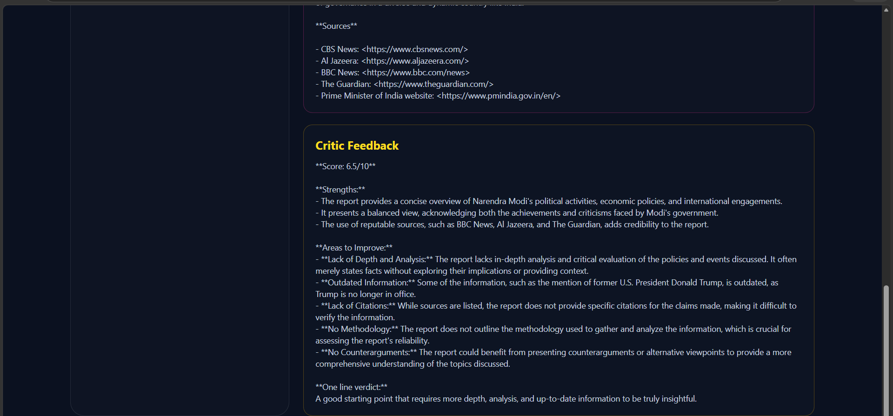

#  Multi-Agent AI Research Assistant

A full-stack **Multi-Agent AI Research Assistant** built using **React, Django, LangChain, and LLM Agents** that performs automated research through multiple AI agents and displays each stage of processing in a modern UI.

---

##  Features

-  **Search Agent** → Finds recent, reliable, and detailed information on a given topic
-  **Reader Agent** → Selects relevant sources and extracts deeper content
-  **Writer Chain** → Generates a structured research report
-  **Critic Chain** → Reviews and provides feedback on the generated report
-  **Modern React UI** with separate outputs for each AI stage
-  Full-stack integration (**React + Django REST API**)

---

##  Tech Stack

### Frontend
- React.js
- Axios
- Tailwind CSS

### Backend
- Django
- Django REST Framework

### AI / GenAI
- LangChain
- LLM Agents
- Prompt Chains
- Search Tools

---

##  System Architecture

```text
User Input
   ↓
Search Agent
   ↓
Reader Agent
   ↓
Writer Chain
   ↓
Critic Chain
   ↓
Frontend UI Output
```

---

##  Screenshots

### Home UI



---

### Search Agent Output



---

### Writer Report Output



---

### Critic Feedback Output



---

##  Installation

### Clone Repository

```bash
git clone https://github.com/YOUR_USERNAME/YOUR_REPO.git
cd YOUR_REPO
```

---

## Backend Setup

```bash
cd backend
python -m venv .venv
source .venv/bin/activate   # Linux/Mac
.venv\Scripts\activate      # Windows

pip install -r requirements.txt
python manage.py migrate
python manage.py runserver
```

Backend runs on:

```text
http://127.0.0.1:8000/
```

---

## Frontend Setup

```bash
cd frontend
npm install
npm run dev
```

Frontend runs on:

```text
http://localhost:5173/
```

---

##  Environment Variables

Create `.env` file in backend:

```env
OPENAI_API_KEY=your_api_key
TAVILY_API_KEY=your_api_key
```

---

##  Project Structure

```text
Multi-Agent-System-with-UI/
│
├── backend/
│   ├── agents/
│   │   ├── agent1.py
│   │   ├── agent2.py
│   │
│   ├── chains/
│   │   ├── writer_chain.py
│   │   ├── critic_chain.py
│   │
│   ├── pipeline.py
│   ├── views.py
│   └── manage.py
│
├── frontend/
│   ├── src/
│   │   ├── App.jsx
│   │   └── components/
│   └── package.json
│
└── README.md
```

---

##  How It Works

### 1. Search Agent
Searches for reliable and recent information about the topic.

### 2. Reader Agent
Analyzes search output and extracts deeper content from relevant sources.

### 3. Writer Chain
Generates a structured research report.

### 4. Critic Chain
Evaluates the generated report and provides feedback.

---

##  Example Workflow

**Input:**

```text
Artificial Intelligence in Healthcare
```

**Output:**

- Search Agent → collects web data
- Reader Agent → extracts deeper content
- Writer Chain → writes report
- Critic Chain → reviews report

---

##  Future Improvements

- Streaming outputs in real-time
- PDF export
- Research history storage
- Authentication
- Async parallel agents
- Faster architecture with LangGraph

---

##  Author

**Suhani vyas**  
B.Tech Computer Science Engineering  
GitHub:https://github.com/vyass4747-lab

---

##  License

MIT License